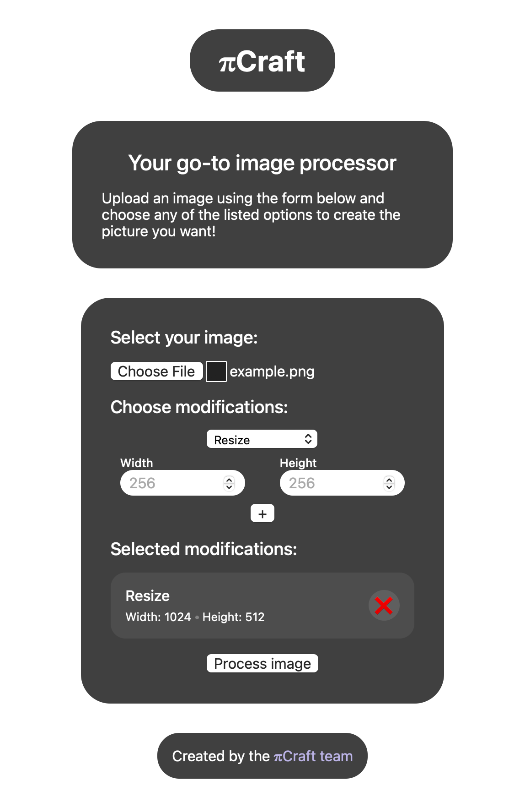

# πCraft

<p align="center">
    
</p>

**πCraft** is a web application that provides the user with the ability to modify images. The modifications include operations like: resizing, compressing, enhancing and changing image format.

The application is composed of two parts: frontend and backend. The frontend empowers the user to interact with the REST API, made available by the backend server.

The backend processes images sent by the user and responds with the modified images. It does not store any data, for longer than sending back the processed picture.

## Usage

### Supported filetypes

- PNG
- JPG & JPEG
- BPM
- HEIC
- GIF
- WEBP
- TIFF

### With the website

1. You should pick a file, which you want to modify,
2. Choose at least one of the 4 available modifications *(you can remove the modifications if you change your mind!)*,
3. Click on the ***Process image*** button.

The processed image should open in the new page.

If there was an error - you will be notified accordingly.

### With the API

To use our application through the API, just send a `multipart/form-data` to any of the endpoints described.

The server will respond with code `200` and send an processed image, if everything finishes successfully. Otherwise you will get an appropriate error code.

## API Endpoints

Every of the following endpoints expects you to send a `POST` request, with the type of `multipart/form-data`. The request should have an image file attached.

### `/resize`

```ts
{
    width: number; // min: 8, max: 8196
    height: number; // min: 8, max: 8196
}
```

### `/compress`

```ts
{
    rate: number; // min: 10, max: 100
}
```

### `/enhance`

*Endpoint has body*

### `/change_format/[format]`

```ts
{
    format: "png" | "jpeg" | "jpg" | "bmp" | "heic"
          | "gif" | "webp" | "tiff";
}
```

### `/combined`

```ts
Array< {
    name: "resize" | "compress" | "enhance" | "change_format";
    params: { /* params of the selected endpoint */ }; 
} >
```
