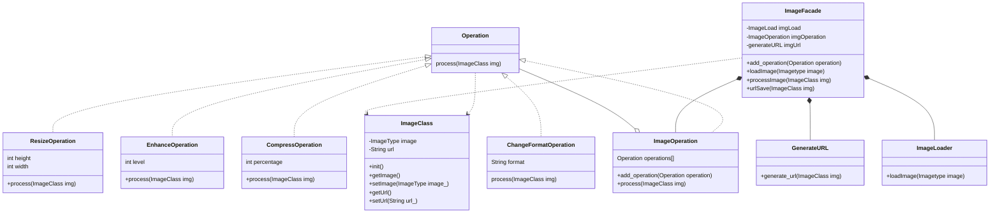

```mermaid
classDiagram
    Operation ..> ImageClass
    ImageFacade ..> ImageClass
    Operation <|.. ResizeOperation
    Operation <|.. EnhanceOperation
    Operation <|.. CompressOperation
    Operation <|.. ChangeFormatOperation
    Operation <|.. ImageOperation
    ImageOperation o-- Operation
    ImageFacade *-- ImageOperation
    ImageFacade *-- GenerateURL
    ImageFacade *-- ImageLoader

    class ImageClass{
        -ImageType image
        -String url
        +init()
        +getImage()
        +setImage(ImageType image_)
        +getUrl()
        +setUrl(String url_)
    }
    class ImageFacade{
        -ImageLoad imgLoad
        -ImageOperation imgOperation
        -generateURL imgUrl

        +add_operation(Operation operation)
        +loadImage(Imagetype image)
        +processImage(ImageClass img)
        +urlSave(ImageClass img)
    }
    class GenerateURL{
        +generate_url(ImageClass img)
    }
    class ImageOperation{
        Operation operations[]
        +add_operation(Operation operation)
        +process(ImageClass img)

    }
    class ImageLoader{
        +loadImage(Imagetype image)
    }

    class Operation{
        process(ImageClass img)
    }
    class EnhanceOperation{
        int level
        +process(ImageClass img)
    }
    class CompressOperation{
        int percentage
        +process(ImageClass img)
    }
    class ResizeOperation{
        int height
        int width
        +process(ImageClass img)
    }
    class ChangeFormatOperation{
        String format
        process(ImageClass img)
    }
```
