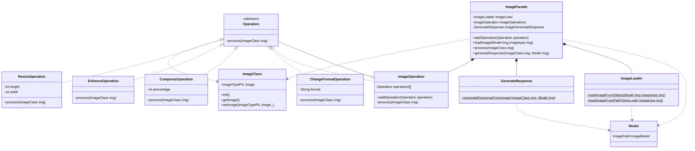

```mermaid

classDiagram
    Operation ..> ImageClass
    ImageFacade ..> ImageClass
    Operation <|.. ResizeOperation
    Operation <|.. EnhanceOperation
    Operation <|.. CompressOperation
    Operation <|.. ChangeFormatOperation
    Operation <|.. ImageOperation
    ImageOperation o-- Operation
    ImageFacade *-- ImageOperation
    ImageFacade *-- GenerateResponse
    ImageFacade *-- ImageLoader
    GenerateResponse ..> Model
    ImageLoader ..> Model
    ImageFacade ..> Model

    class Model{
        ImageField imageModel
    }

    class ImageClass{
        -ImageTypePIL image
        +init()
        +getImage()
        +setImage(ImageTypePIL image_)
    }
    class ImageFacade{
        -ImageLoader imageLoad
        -ImageOperation imageOperations
        -GenerateResponse imageGenerateResponse

        +addOperation(Operation operation)
        +loadImage(Model Img,Imagetype img)
        +process(ImageClass img)
        +generateResponse(ImageClass img, Model Img)
    }
    class GenerateResponse{
        +generateResponseFromImage(ImageClass img, Model Img)$
    }
    class ImageOperation{
        Operation operations[]
        +addOperation(Operation operation)
        +process(ImageClass img)

    }
    class ImageLoader{
        +loadImageFromObject(Model Img,Imagetype img)$
        +loadImageFromPath(String path,Imagetype img)$

    }
    class Operation{
        +process(ImageClass img)*
    }
    <<abstract>> Operation
    class EnhanceOperation{
        +process(ImageClass img)
    }
    class CompressOperation{
        -int percentage
        +process(ImageClass img)
    }
    class ResizeOperation{
        -int height
        -int width
        +process(ImageClass img)
    }
    class ChangeFormatOperation{
        -String format
        +process(ImageClass img)
    }

```
